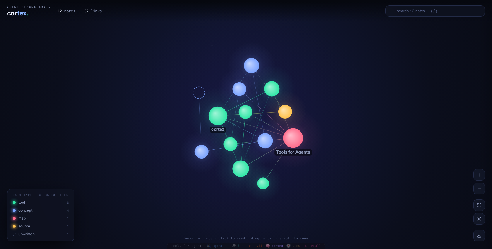

# 🧠 cortex

[](https://github.com/tools-for-agents/cortex/actions/workflows/ci.yml)

**A local, Obsidian-compatible second brain for agents.**

An agent that re-derives the same facts every session is spending tokens to stay ignorant. `cortex` gives it a **durable, wikilinked knowledge base** on disk: it distils what it learns into small interconnected markdown notes, then recalls *just enough* of them later. Notes link to each other with `[[wikilinks]]`, so the brain becomes a **graph** you can traverse — backlinks, related notes, hubs, orphans — not a flat pile of memories.

Every note is a plain markdown file in a folder, so **you can open the exact same vault in [Obsidian](https://obsidian.md)** and watch the graph grow. Based on Andrej Karpathy's *LLM Wiki* pattern: compile knowledge once into an interconnected wiki instead of asking the model the same questions over and over.

Part of [`tools-for-agents`](https://github.com/tools-for-agents). **Zero dependencies** — Node standard library + built-in `node:sqlite` with FTS5. The markdown files are the source of truth; the SQLite index is derived and rebuildable at any time.

---

## Why

| Without cortex | With cortex |
|---|---|
| Re-explain the same architecture every session | `cortex_search "our auth design"` → the note you already wrote |
| Memories are a flat list — no structure | Notes link with `[[wikilinks]]` → a real knowledge graph with backlinks |
| "What did I decide about X, and what's related?" | `cortex_related "X"` → linked notes, co-citations, shared tags |
| Memory locked inside one tool | A folder of markdown you (and Obsidian) fully own and can edit |
| Knowledge grows unmanaged | `cortex_graph` surfaces orphans + broken links to fill in |

## The vault

`cortex` keeps notes in `$CORTEX_VAULT` (default `./vault`), organised by type — the Karpathy LLM-Wiki layout:

```
vault/
├── concepts/     # ideas, frameworks, theories
├── entities/     # people, orgs, products, tools
├── sources/      # captured raw material + summaries
├── synthesis/    # comparisons, analyses, themes
├── daily/        # timestamped journal, one file per day
├── notes/        # anything else
└── .cortex/      # the derived SQLite index (safe to delete & rebuild)
```

A note is just markdown with YAML frontmatter:

```markdown
---
title: Backpropagation
type: concept
tags: [deeplearning]
---

The algorithm that trains [[Neural Networks]] by propagating error via the
chain rule. Uses [[Gradient Descent]]. #optimization
```

Write `[[Other Note]]` to link and `#tags` to categorise. Links to notes that don't exist yet are **broken links** — cortex tracks them as suggestions, and they **heal automatically** the moment you write that note.

## CLI

```bash
cortex write "Neural Networks" --type concept --tags ml,ai \
  --body "Function approximator. Trained by [[Backpropagation]]. #deeplearning"
cortex write "Neural Networks" --append --body "Modern variants: [[Transformers]]."
cortex capture "raw article text…" --source https://example.com   # inbox for later
cortex search "train network error" -k 6 --tag deeplearning        # ranked snippets
cortex read "Neural Networks"                                      # full note
cortex links "Neural Networks" --in                                # backlinks
cortex related "Backpropagation"                                   # graph neighbourhood
cortex suggest "Backpropagation"                                   # notes to link that aren't linked yet
cortex lint                                                        # health report: orphans/broken/untagged/stubs
cortex tags | cortex tags deeplearning                             # tags → notes
cortex graph                                                       # hubs, orphans, broken links
cortex daily "shipped the retriever"                               # journal
cortex sync                                                        # re-index after Obsidian edits
cortex serve --port 7800                                           # live graph web view
cortex stats
```

Vault location: `$CORTEX_VAULT` (default `./vault`).

## Web view



`cortex serve` starts a **zero-dependency** web app at `http://localhost:7800` — a premium, Obsidian-style **knowledge graph** of your vault rendered on canvas: glowing nodes (sized by connections, coloured by type) joined by `[[wikilink]]` synapses.

- **Hover** any note to trace its neighbourhood — connected notes light up with energy flowing along the links, everything else dims.
- **Click** a note to read it in a side panel (fetched live): its body with clickable `[[wikilinks]]`, its tags, and its *links to* / *linked from* lists — navigate note-to-note with a back button.
- **Search** from the top bar (ranked dropdown, keyboard-navigable), **filter** by type from the legend, click the stat for a **graph overview** (hubs, type breakdown).
- Drag to rearrange, scroll/pinch to zoom, recenter, and a light/dark theme toggle.
- **Minimap** — a small overview of the whole brain sits in the top-left, with a rectangle marking the part you're looking at; click or drag on it to fly across a large graph without losing your place.
- **Live** — the server watches the vault and pushes updates over SSE, so the graph grows in real time as your agent (or you, in Obsidian) writes notes. It's the same brain your agent writes to — watch it grow.

Want a graph to look at right away? Seed a starter vault (interlinked notes about the toolkit itself):

```bash
CORTEX_VAULT=./vault node scripts/seed.js   # 12 connected notes, 0 orphans
node src/cli.js serve
```

## MCP server (for agents)

```jsonc
{
  "mcpServers": {
    "cortex": { "command": "node", "args": ["/abs/path/to/cortex/mcp/mcp-server.js"],
                "env": { "CORTEX_VAULT": "/abs/path/to/your/vault" } }
  }
}
```

### Tools

| Tool | Use it to… |
|---|---|
| `cortex_write` | Create/update a note — link with `[[wikilinks]]`, tag with `#tags`. Distil learnings into small interconnected notes. |
| `cortex_capture` | Stash raw material (article, transcript, finding) into the source inbox to distil later. |
| `cortex_search` | Recall what you already know as ranked, **token-budgeted** snippets — instead of re-deriving it. |
| `cortex_read` | Read a full note by title / slug / alias. |
| `cortex_links` | A note's backlinks (in), forward links (out, broken ones flagged), or both. |
| `cortex_related` | Notes related by direct links, co-citation and shared tags. |
| `cortex_suggest` | Notes this one *should* link to but doesn't yet — weave orphans into the graph. |
| `cortex_lint` | Vault health: orphans, broken links (a to-do list of notes to write), untagged notes, stubs. |
| `cortex_tags` | All tags with counts, or the notes for one tag. |
| `cortex_graph` | Graph health: hub notes, orphans, and broken links worth writing. |
| `cortex_recent` | Most recently updated notes. |
| `cortex_daily` | Append a timestamped line to today's journal — a trail across sessions. |
| `cortex_sync` | Re-index the vault after files change on disk (e.g. edited in Obsidian). |
| `cortex_stats` | Note / link / tag counts, broken links, types. |

### A good loop for an agent

1. **Recall first** — `cortex_search` before solving; you may have already worked this out.
2. **Capture** raw findings with `cortex_capture` as you go.
3. **Distil** into small `cortex_write` notes, each linking to related concepts with `[[…]]`.
4. **Connect** — check `cortex_graph` for orphans and broken links, and write the missing notes.
5. **Journal** the session with `cortex_daily` so the next run has a trail.

## How it works

- **Files are truth.** Each note is a markdown file with YAML frontmatter; the SQLite index is derived from them and rebuilt by `sync` (incremental by mtime). Delete `.cortex/` any time — it regenerates.
- **Search** is FTS5 (`porter unicode61`) ranked by **bm25**, filling snippets up to a token budget (≈4 chars/token) — the same discipline as [`lens`](../lens), pointed at your brain instead of a codebase.
- **The graph** is a link table. Every `[[target]]` is resolved to a note by slug, title or alias; unresolved targets are kept as broken links and heal automatically when the target note appears.
- **Slugs** are unicode-aware (Turkish and accented titles transliterate to clean ascii filenames).
- **Obsidian-compatible** end to end: open `$CORTEX_VAULT` as a vault and the wikilinks, tags and graph view all just work.
